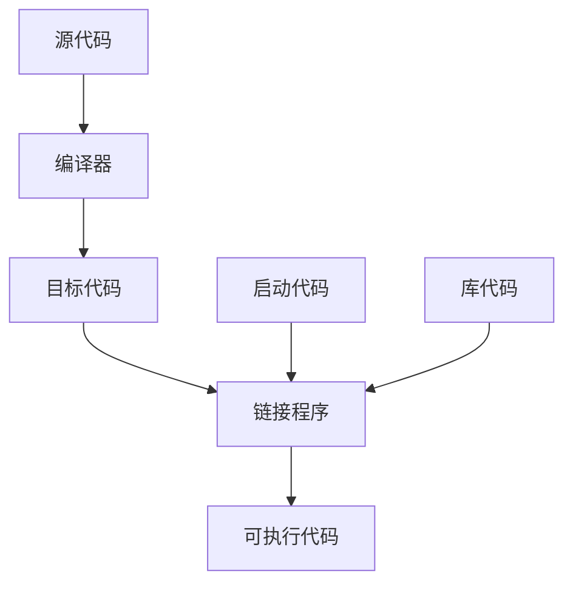

# Chapter 1

## 1.1 C++简介

C++融合了3种不同的编程方式：

- C语言代表的过程性语言
- C++在C语言基础上添加的类代表的面向对象语言
- C++模板支撑的泛型编程

## 1.2 

### C语言

C语言的理念：过程性(procedural)语言，强调算法方面

计算机要处理两个概念：数据 + 算法

- 数据：程序使用和处理的信息
- 算法：程序使用的方法

编程方法：结构化编程(structured programming)(for循环，while循环，do while循环，if else语句)

新原则：自顶向下(top-down)将大型程序分解成小型、便于管理的任务

过程性编程思想：根据执行的操作来构思一个程序

### 面向对象编程OOP

OOP：强调数据

理念：设计与问题的本质特性相对应的数据格式

OOP程序设计方法首先设计类，表示程序要处理的东西

### 泛型编程(generic programming)

C++支持的一种编程模式

强调独立于特定数据类型

C++模板

### 程序创建

