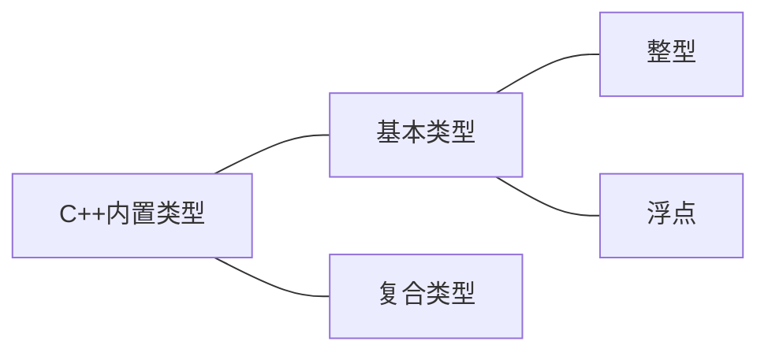

# Chapter 3 处理数据



## 3.1

为将信息记录到计算机中，程序必须记录3个基本属性：

- 信息存储在哪里
- 要存储什么值
- 存储什么类型的信息

### 变量名

C++提倡使用有一定意义的变量名

命名规则：

- 名称中只能使用字母，数字和下划线
- 名称的第一个字符不能是数字
- 区分大小写
- 不能使用C++关键字
- 以双下划线 `__` 或下划线加大写字母开头 `_N` 的名称将保留，用作编译器及其使用资源使用。以一个下划线开头 `_` 的名称将保留给全局标记符

*<u>变量命名方案</u>*

- <u>*使用大写字母*</u>
- <u>*描述变量类型或内容的前缀：s(字符串), b(bool类型), p(指针), c(单个字符)*</u>

### 整型

宽度(width)：用于描述存储整数时使用的内存量

10种基本整型：char, short, int, long, long long(C++11)及它们的无符号版本

C++整型标准：

- short至少16位
- int至少与short一样长
- long至少32位，且至少与int一样长
- long long至少64位，且至少与long一样长

2^8^ = 255, 2^16^ = 65536

一个字节通常为8位，这依赖于实现。

头文件`climits` 中包含了关于整型限制的信息。

```c++
//3.1 limits.cpp
#include<iostream>
#include<climits>
int main()
{
    using namespace std;
    int n_int = INT_MAX;
    short n_short = SHRT_MAX;
    long n_long = LONG_MAX;
    long long n_llong = LLONG_MAX;
    
    cout << "int is " << sizeof (int) << " bytes." << endl;
    cout << "short is " << sizeof n_short << " bytes." << endl;
    cout << "long is " << sizeof n_long << " bytes." << endl;
    cout << "long long is " << sizeof n_llong << " bytes." << endl;
    
    cout << "Maximum value is:" << endl;
    cout << "int: " << n_int << endl;
    cout << "short: " << n_short << endl;
    cout << "long: " << n_long << endl;
    cout << "long long: " << n_llong << endl;
    
    cout << "Minimum int value = " << INT_MAX << endl;
    cout << "Bits per byte = " << CHAR_BIT <<endl;
    
    return 0;
}
```

### 初始化

初始化：在第一次声明变量的时候赋值。

有几种不同的初始化方式：

- "="号：传统的C初始化 `int value = 5;` "="号后面应为常量或已知的变量。
- "()"：C++新加入初始化 `int value(123);` 

C++11初始化方法：

- "{}" ：`int value = {5};` 或 `int value{5}` ( `=` 号可选 ) 通用初始化语法

### 无符号类型

关键字 `unsigned` ：

- `unsigned short value`
- `unsigned value` : `unsigned`本身是 `unsigned int` 的缩写
- `unsigned long value`
- `unsigned long long` 

### 选择整型类型

自然长度(natural size)：计算机处理效率最高的长度

通常，`int` 被设置为计算机的自然长度，在没有必要的形况下，应该使用 `int` 类型

几种使用其他类型的原因：

- 如果变量表示的值不可能为负数，则使用 `unsighed` 
- 如果直到表示的值会大于16位整数的最大可能值，则应使用 `long` 
- 当使用大型整数数组时，才有必要使用 `short` ；如果节省内存很重要，则应使用 `short` ，如果只需要一个字节，可使用 `char` 

### 整型字面值

 整型字面值(常量)是显式的书写常量

C++与C都可以用3种不同的计数方式：

- 十进制：第一位为1 ~ 9
- 八进制：第一位为1，第二位为1 ~ 7
- 十六进制：前两位为0x或0X

默认情况下，`cout` 用十进制显示整数，使用 `dec` ，`oct` 和 `hex` 控制 `cout` 的输出

### C++确认常量的类型

除非有特殊理由（使用了特殊后缀或者值太大），否则C++将整型常量存储为int类型

### char类型

`char` 默认情况下既不是无符号，也不是有符号，由C++实现决定，可以显式的定义

### 宽字符类型

`wchar_t` 宽字符类型：用 `wcout` 和 `wcin` 来处理`wchar_t`流

可以通过前缀L表示宽字符常量和宽字符串

`wchar_t value = L'P';` 

`wcout << L"tall" << endl;` 

C++11中，新增了 `char16_t` 和 `char32_t` 类型

- `char16_t` 长16位，无符号，前缀u表示常量
- `char32_t` 长32位，无符号，前缀U表示常量

`char16_t ch1 = u'q'` 

`char32_t ch2 = U'q'` 

## 3.2 const限定符

符号常量：

- `#define` ：C语言常用，不推荐，约定：整个变量大写
- `const` ：C++创建符号常量，通常首字母大写

## 3.3 浮点数

C++两种书写浮点数的方式：

- 标准小数点表示法：`12.23`
- E表示法：`2.32e+4` 或 `23.3E-9` ，`+` 号可省略

### 浮点类型

3种浮点类型：float, double和long double

有效位(significant figure): 数字中有意义的位

C++有效位数要求：

- float：至少32位，通常为32位，有效位数最多为6位，其他将四舍五入
- double：至少48位，且不少于float，通常为64位
- long double：至少和double一样多，通常为80、96或128位

头文件`cfloat`或`float.h` 查看系统的限制

### 浮点常量

默认保存为double类型，后缀f和L

## 3.4

### 类型转换

自动执行类型转换的情况：

- 一种算数类型的值赋给另一种算数类型的变量时
- 表达式中包含是不同的类型时
- 将参数传递给函数时

详细介绍：

1. 初始化和赋值进行的转换

   - 将一个值赋值给取值范围更大的类型通常不会出现问题
   - 较大的浮点类型转换为较小的浮点类型，精度(有效位数)降低，超出取值范围时，结果不确定
   - 浮点转换为整型，小数部分丢失，超出取值范围时，结果不确定
   - 较大的整型转换为较小的整型，可能超出取值范围，通常只复制右边的字节
   - 0赋值给 `bool` 类型，为 `false` ；非零值为 `true` 

2. {}方式初始化（C++11）

   C++11使用大括号的初始化成为列表初始化(list-initialization)，它对类型转换的要求更严格，列表初始化不允许窄缩(narrowing)，变量的类型可能无法赋给它的值

3. 表达式中的转换

   整型提升(integral promotion)：将bool, char, unsigned char, signed char和short的值转换为int

4. 传递参数时的转换

5. 强制类型转换
